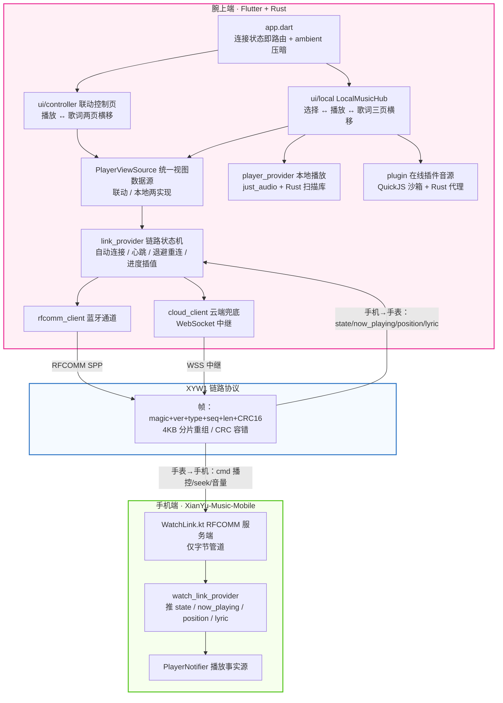

<div align="center">
  

# 弦予音乐 · 腕上端
## (XianYu-Music-Watch)

弦予音乐的腕上端（Wear OS）。基于 **Flutter + Rust** 跨平台架构，与移动端同源复用 Rust 核心（`libxianyu_core.so`），通过 [flutter_rust_bridge](https://github.com/fzyzcjy/flutter_rust_bridge) 桥接。连接手机时是**播放延伸控制器**（高德腕上式拉起 + QQ 音乐手表式控制页），独立运行时是**完整播放器**（本地 + 在线插件音源）。

 [](https://flutter.dev/)
 [](https://www.rust-lang.org/)
 [](https://dart.dev/)

</div>

## ✨ 功能亮点

- ⌚ **双形态一体**

  - **联动模式**：蓝牙 RFCOMM 远程控制手机播放——播放/暂停、上下曲、进度 seek、喜欢、播放模式、表冠调音量；手机开播自动经通知拉起手表 App（IMPORTANCE_HIGH + fullScreenIntent，规避 Wear OS 3 后台启动限制）。
  - **独立模式**：断连状态下完整本地播放（Rust 并行扫描 / 标签解析 / 封面提取）+ 在线插件音源，与手机互不干扰；两模式底部一键切换、可共存。

- 🔗 **自研腕上链路协议**

  - **XYW1 二进制帧**：`magic + ver + type + seq + len + CRC16` 帧格式，payload 4KB 上限自动分片重组，CRC 损坏帧丢弃、粘包/半包容错。
  - **可靠连接**：配对地址持久化自动连接、3s 心跳、10s 无帧判死、1→30s 指数退避重连、本地 1s 进度插值。
  - **云端兜底**：蓝牙不可达时自动切换服务器 WebSocket 中继（XYW1 帧原样转发），密钥仅经蓝牙安全信道下发。

- 🎵 **网易云手表式播放 UI**

  - **圆屏三页横移**：选择页（彩色圆图入口）↔ 播放页 ↔ 歌词页，左右滑动切换 + 底部圆点指示，联动控制页同款两页形态。
  - **圆屏交互**：环形进度拖拽 seek、长按 ±10s 连续跳、表冠旋转调音量（本地 HUD + 250ms 节流下发）。
  - **歌词双通道**：本地/在线播放开箱即得（Rust API 读 LRC / 插件歌词）；联动模式由手机推送归一化歌词（协议 type 0x13），当前行高亮 + 自动滚动 + 点行 seek。

- 🌐 **在线插件音源（与移动端同栈）**

  - **双格式插件**：兼容 MusicFree / LX 落雪插件，QuickJS 沙箱执行，HTTP 请求经 Rust 代理无 CORS 限制；URL 一键安装。
  - **在线播放**：插件取流 + 防盗链 headers，音质偏好持久化。

- 🔋 **腕上功耗与体积优化**

  - **Wear OS 环境模式**：系统 ambient 下全局压暗 60% + 冻结动画直跳目标行，OLED 防烧屏省电；非 Wear 设备自动降级不崩溃。
  - **极致体积**：v8 单架构包仅 **~15.3MB**（`.so` 包内压缩 + Dart AOT 混淆 + R8 收缩）；支持按表选 v8/v7 单架构出包，也支持双 ABI 全量包。

---

## 🛠️ 使用源码构建运行

### 环境要求

| 依赖项 | 推荐版本 / 要求 |
| --- | --- |
| **Flutter** | `3.47.0+`（Dart `3.13.0`） |
| **Rust** | Stable 稳定版（构建钩子自动编译，与移动端同机制） |
| **JDK** | **必须是 21**（JDK 25 会让 Kotlin daemon 崩溃，见下方构建环境说明） |
| **Android** | Android SDK + NDK；compileSdk 36 / targetSdk 34 / minSdk 28；真机开启 USB 调试 |

### 运行与调试

1. 克隆本仓库并安装依赖：

  ```bash
  git clone https://github.com/TaXiaoQi/XianYu-Music-Watch.git
  cd XianYu-Music-Watch
  flutter pub get
  ```

2. 开发调试（热重载 `r` / 热重启 `R`）：

  ```powershell
  flutter run
  ```

  > **Rust 自动编译**：`flutter run` / `flutter build` 均会自动检测并编译 Rust（绑定 + `.so`）——改内部逻辑直接生效；改 API 时首次构建会中止，重跑一次命令即可。`XIANMU_SKIP_RUST=1` 可跳过。

3. 测试（协议编解码 / 分片重组 / CRC 容错等单测）：

  ```powershell
  flutter test
  ```

### 构建安装包

#### Android（.apk）

按目标表的 ABI 分两条指令（Rust 自动编译，`XIANMU_RUST_ABI` 控制只编对应架构）：

**v8 包 — 64 位表（Wear OS 3+：三星 GW4/GW5/GW6、小米 S 系列、OPPO Watch 等）**

```powershell
flutter build apk --v8
```

**v7 包 — 32 位国表（华为 GLL-AL00 等 armeabi-v7a 表）**

```powershell
flutter build apk --v7
```

> `--v7` / `--v8` 由本机 PowerShell profile 的 flutter 包装函数支持：自动注入
> `XIANMU_RUST_ABI`、补 `--release` 与对应 `--target-platform`，等价于完整写法
> `$env:XIANMU_RUST_ABI='v8'; flutter build apk --release --target-platform android-arm64`。

**全量双 ABI 包（不挑表，单包兼容 32/64 位，体积更大）**

```powershell
flutter build apk --release
```

一条命令完成全部发版动作：

- Rust 自动编译 + Dart AOT 混淆 + R8 收缩 + `.so` 包内压缩
- `--target-platform` 决定 Dart AOT 与引擎架构；gradle 侧读取该属性自动裁剪 `abiFilters`（`disable-abi-filtering` 拦掉了 Flutter 插件的自动过滤，工程内自行补齐，见 `app/build.gradle.kts`）
- `XIANMU_RUST_ABI=v8/v7` 只编对应架构的 Rust `.so`，缺省双 ABI 全编；未选中 ABI 的既有产物保留不重编
- 产物自动归档到 `releases/android/弦予音乐v<版本>-Watch.apk`（Gradle `archiveReleaseApk` 钩子；预发布版本名自带 -betaN 后缀）
- 正式签名已配独立 keystore（alias `xianyu_watch`，材料 gitignore）；`key.properties` 缺失时回退 debug 签名，保证 CI 可构建

> 开发调试 `flutter run` 不需要这些参数：Flutter 按连接设备的 ABI 自动选择（32 位表自动 `android-arm`），Rust 钩子默认双 ABI 编译、缓存增量生效。

### ⚠️ 构建环境已知坑（这台机器踩平的）

- **JDK 必须 21**：系统默认 JDK 22+ 会让 Kotlin daemon 崩溃。用户级 `~/.gradle/gradle.properties` 配 `org.gradle.java.home=<JDK21 路径>`
- `android/gradle.properties` 已配：`kotlin.compiler.execution.strategy=in-process`（daemon 在本机崩溃）+ `kotlin.incremental=false`（增量缓存报错）+ `android.overridePathCheck=true` + `disable-abi-filtering=true`（防插件清掉 abiFilters 导致三套引擎 30MB 包）
- Gradle 9.1.0（腾讯镜像）/ AGP 9.0.1 / Kotlin 2.3.20，仓库走阿里云镜像（`settings.gradle.kts`）
- 工程路径含空格（`Program Files`）已验证可正常构建；但鸿蒙 ohpm 等工具链如有异常优先排查空格路径

---

## 📐 技术架构

腕上端与手机端组成「主从播放」体系：手机是播放事实源（手机端 App 或其后台服务），手表既远程操控也可独立播放。通信走自研 XYW1 二进制协议，传输层双通道（蓝牙 RFCOMM 优先，云端 WebSocket 兜底）。



### 模块划分

| 模块 | 路径 | 职责 |
| --- | --- | --- |
| **链路状态机** | `lib/src/link/` | `link_provider`（自动连接 / 3s ping / 10s 判死 / 指数退避重连 / 本地进度插值 / 表冠音量）、`rfcomm_client`（蓝牙通道）、`cloud_client`（云兜底）、`protocol`（XYW1 帧编解码 + 分片重组，与手机端严格镜像） |
| **共享播放 UI** | `lib/src/ui/player/` | `play_page_body`（圆屏大封面 + 环形进度 seek + 五键控制）、`lyrics_view`（逐行高亮 + 自动滚动 + 点行 seek）、`page_dots`、`player_source`（联动/本地双数据源抽象） |
| **联动控制页** | `lib/src/ui/controller/` | 手机播放的延伸控制（播放 ↔ 歌词两页横移），歌词经链路接收 + LRU 解析缓存 |
| **独立模式** | `lib/src/ui/local/`、`lib/src/library/` | `LocalMusicHub` 三页主壳（网易云手表式）、本地库扫描列表、在线搜索页 |
| **在线插件** | `lib/src/plugin/` | 从移动端移植的插件引擎（MusicFree / LX 双格式，去云同步等移动端专属逻辑） |
| **歌词** | `lib/src/lyrics/` | 与移动端镜像的歌词模型 + 仓库（本地 Rust API / 链路推送双通道） |
| **Rust 底座** | `rust/` | 与移动端同源 `libxianyu_core`：本地音乐扫描 / 元数据解析 / 设置持久化 |
| **原生层** | `android/` | `WatchLinkClient`（RFCOMM 客户端 + 读线程 + 后台拉起通知）、ambient 生命周期观察（非 Wear 设备自动降级） |

### 关键机制速记

- **握手**：手表连接成功发 `hello{role:'watch'}`；手机回 hello 并立即推送 `now_playing + state + position` 快照；ping 由手表发起，手机只回 pong。
- **拉起（高德腕上式）**：手表后台收到 `now_playing` → 原生层发 fullScreenIntent 高优通知拉起 App；前台时按连接状态自动切页，不发通知。
- **音量**：表冠旋转本地即时 ±0.05 并 250ms 节流下发 `cmd{action:'volume'}`；手机回推 state 校准。
- **歌词**：本地模式 Rust API 直读；联动模式手机在切歌时推送归一化歌词 payload（0x13 帧，超限自动分片），手表校验歌曲 id 一致才展示。

---

*更新日期：2026-09-13*
